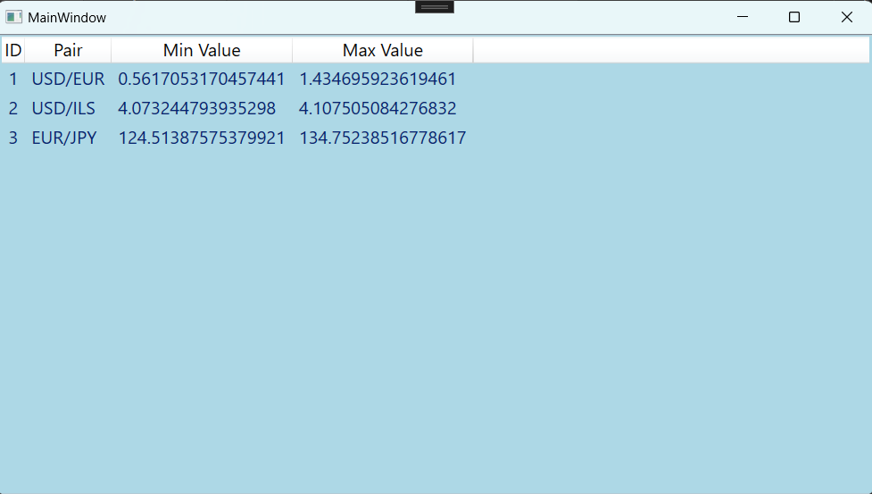

# Currency Trading Simulator

This application simulates real-time trades on currency pairs, such as USD/EUR.
It is built using a three-layer architecture: UILayer, BusinessLayer, and DataLayer.

## Features

- Simulates changes in maximum and minimum prices for currency pairs.
- Prices change randomly between 1.5 and 2.5 seconds.
- Uses multithreading to handle real-time updates.
- Data is stored in a SQL Server database.

## Getting Started

### Prerequisites

- .NET Core SDK
- SQL Server
  
## Configuration

1. **Configure the Database Connection**:
   - Copy the file `DataLayer/appsettings.json.example` to `DataLayer/appsettings.json`.
   - Open `DataLayer/appsettings.json` and replace the placeholder connection string with your own.
   ```json
   {
     "ConnectionStrings": {
       "DefaultConnection": "Your_Connection_String_Here"
     }


   


